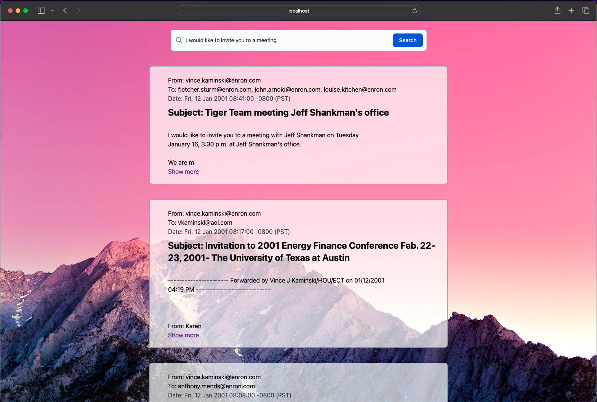

# Indexer project

## Setup
Se necesitan las siguientes herramientas instaladas:<br>
- jq (https://jqlang.github.io/jq/)

Se requiere dar permisos de ejecucion a los scripts:
- scripts/load_data.sh
- scripts/start.sh
- scripts/convert_json_to_ndjson.sh

Estos permisos se dan con el siguiente comando:
```
chmod +x /ruta/al/script.sh
```

## App

Esta app esta desarrollada con las siguientes tecnologias:

- Golang
- Vue js
- Zincsearch
- Chi

### Vista previa

</img>
<!-- <video src="./media/emailapp.mov"></video> -->
<iframe width="560" height="315" src="https://www.youtube.com/embed/wcz3hfWHA34?si=xJ260z3O19wfKvF6" title="YouTube video player" frameborder="0" allow="accelerometer; autoplay; clipboard-write; encrypted-media; gyroscope; picture-in-picture; web-share" allowfullscreen></iframe>
