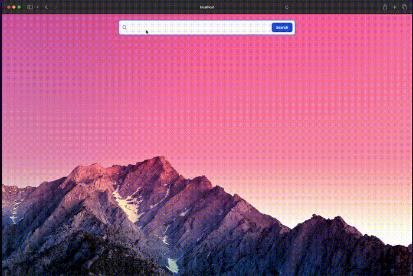

# 🔥🔥 Indexer project 🔥🔥

## 🌟🚀 App 🌟🚀
### 🧐🧐 Vista previa 🧐🧐
#### Video 🎥

#### Imagen 📸


### 🚀🚀 Información tecnica 🚀🚀
Esta app esta desarrollada con las siguientes tecnologias:

- Golang ⚡
- Vue js 🍀
- Zincsearch 🔍
- Chi 🏹
- Docker 🌊
- Bash scripting 🐛


## 👷‍♀️👷‍♂️ Setup 👷‍♀️👷‍♂️
Se necesitan las siguientes herramientas instaladas:<br>
- jq (https://jqlang.github.io/jq/)

Se requiere dar permisos de ejecucion a los scripts:
- scripts/load_data.sh
- scripts/start.sh
- scripts/convert_json_to_ndjson.sh

Estos permisos se dan con el siguiente comando:
```
chmod +x /ruta/al/script.sh
```

Una hemos hecho esto solo necesitaremos ejecutar el siguiente script en la ruta raiz del proyecto

```
./scripts/start.sh
```